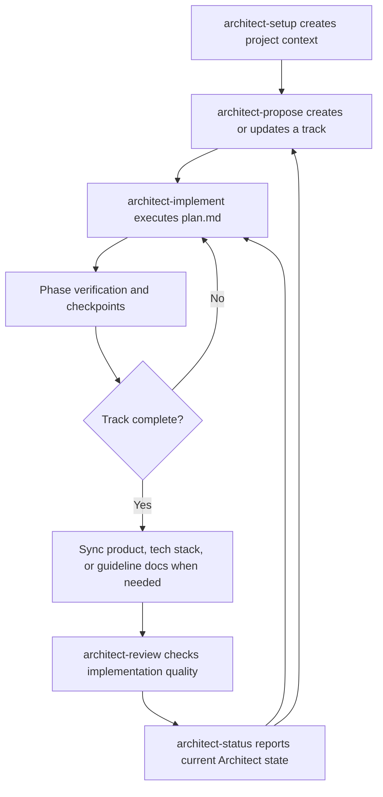

# Architect Overview

Architect is a structured workflow for turning product context into track-based implementation work. It keeps product intent, technology decisions, implementation plans, status, and review artifacts under `architect/` so an agent can resume work predictably.

## Core Model

- `architect/product.md`: Product definition and goals.
- `architect/product-guidelines.md`: UX, tone, accessibility, and product quality guidance.
- `architect/tech-stack.md`: Approved technology choices and constraints.
- `architect/workflow.md`: Task lifecycle, testing expectations, verification rules, and implementation modes.
- `architect/tracks.md`: Registry of active and completed tracks.
- `architect/tracks/<track_id>/`: One track's `spec.md`, `plan.md`, `metadata.json`, and `index.md`.

## Workflow Summary



## Command Roles

- `/architect-setup`: Initializes or repairs the `architect/` project context. It creates the product, guidelines, tech stack, workflow, index, and initial track artifacts.
- `/architect-propose`: Defines a track from a requested feature, bug fix, or enhancement. It creates a specification and a phase-based implementation plan.
- `/architect-implement`: Executes an approved track plan. It updates task status, runs verification, creates phase checkpoints when allowed, finalizes the track, and synchronizes project docs.
- `/architect-review`: Reviews completed or in-progress work for bugs, risks, regressions, and missing tests.
- `/architect-status`: Reports initialized context, track registry state, active work, and next recommended actions.

## Usage

A typical minimal flow looks like this:

```text
/architect-setup
/architect-propose add a password reset flow
/architect-implement 20260427_add_password_reset
/architect-review 20260427_add_password_reset
/architect-status
```

`/architect-implement` and `/architect-review` can take a track ID or track description. If omitted, Architect reads `architect/tracks.md`, selects the next relevant track, and asks for confirmation before proceeding.

For a small existing project, a simple interaction might be:

```text
User: /architect-setup
Agent: Creates architect/product.md, workflow.md, tracks.md, and an initial track.

User: /architect-propose add CSV export to the reports page
Agent: Creates a track spec and phase-based plan.

User: /architect-implement add CSV export
Agent: Confirms the matching track, asks for Manual Mode or Auto Mode, then executes the selected track plan.

User: /architect-review add CSV export
Agent: Reviews the selected track's implementation for bugs, regressions, and missing tests.
```

## Implementation Modes

`/architect-implement` selects the mode after loading track context and before marking the track in progress.

- **Manual Mode:** Preserves human confirmation at phase boundaries. The agent presents manual verification steps and waits for explicit approval before continuing.
- **Auto Mode:** Runs the full `plan.md` without phase-level human confirmation. The agent performs feasible verification itself, records limitations, creates phase checkpoint commits, and continues until the track is complete or a safety boundary is reached.

Auto Mode still stops for unrecoverable failures, failed verification after allowed fix attempts, significant tech stack changes, destructive cleanup, or sensitive product guideline changes.

## Detailed Flow Charts

Detailed Mermaid diagrams live in `flow-charts/`:

- [Setup Flow](./flow-charts/architect-setup-flow.md)
- [Propose Flow](./flow-charts/architect-propose-flow.md)
- [Implement Flow](./flow-charts/architect-implement-flow.md)
- [Review Flow](./flow-charts/architect-review-flow.md)
- [Status Flow](./flow-charts/architect-status-flow.md)
