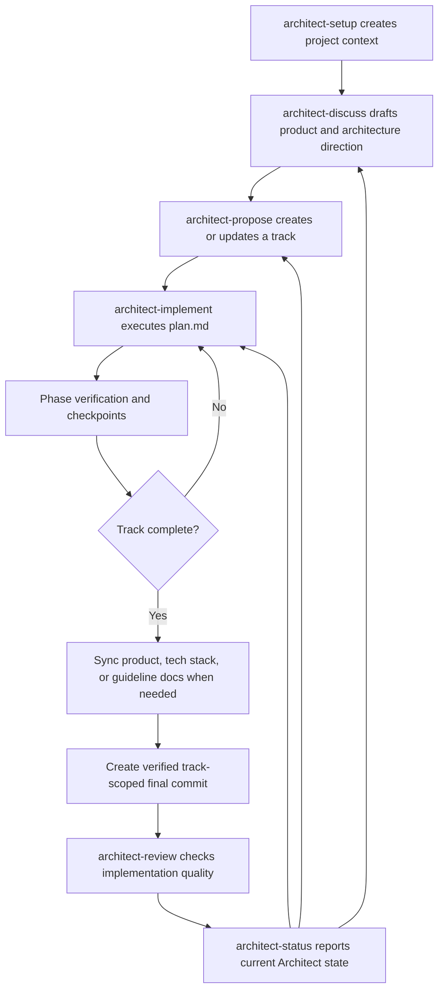

# Architect Overview

Architect is a structured workflow for turning product context into track-based implementation work. It keeps product intent, technology decisions, implementation plans, status, and review artifacts under `architect/` so an agent can resume work predictably.

## Core Model

- `architect/product.md`: Product definition and goals.
- `architect/product-guidelines.md`: UX, tone, accessibility, and product quality guidance.
- `architect/tech-stack.md`: Approved technology choices and constraints.
- `architect/workflow.md`: Task lifecycle, testing expectations, verification rules, and implementation modes.
- `architect/tracks.md`: Registry of active and completed tracks, created by `architect-propose` when the first confirmed track is proposed.
- `architect/tracks/<track_id>/`: One track's `spec.md`, `plan.md`, `metadata.json`, and `index.md`, created by `architect-propose`.

## Protocol Semantics

Each Architect protocol separates four kinds of instruction so workflow behavior remains explicit:

- **Hard Boundaries:** Invariants that no workflow state or inferred intent may override.
- **State Model:** Legal artifact and task states, plus their transition order.
- **Decision Rules:** Evidence-based routing for automatic progress, clarification, fallback, or stopping.
- **Approval Boundaries:** The exact user action that authorizes a side effect such as writing, committing, archiving, or deleting.

Protocol files are the runtime source of truth. Flow charts summarize them and must not introduce extra gates or side effects.

## Task Status Granularity

During proposal, Architect asks whether `plan.md` should synchronize status at `task` or `sub-task` granularity. `sub-task` remains the default for backward compatibility.

- **Task:** Only parent tasks have checkboxes. Nested bullets are required implementation details completed within the parent task.
- **Sub-task:** Parent tasks and actionable nested sub-tasks have checkboxes, preserving fine-grained progress synchronization.

The selected value is recorded near the top of `plan.md`. Existing plans without a declaration continue to use `sub-task` behavior.

## Workflow Summary



## Command Roles

- `/architect-setup`: Initializes or repairs the core `architect/` project context. It creates the product, guidelines, tech stack, code style guides, workflow, and index, then recommends `architect-discuss`.
- `/architect-discuss`: Clarifies early product or technical requirements and produces a product/architecture draft before formal track proposal work. It does not create tracked Architect artifacts.
- `/architect-propose`: Defines a track from a requested feature, bug fix, or enhancement. It creates the tracks registry when needed, then creates a specification and a phase-based implementation plan.
- `/architect-implement`: Executes an approved track plan. It updates task status, runs verification, creates phase checkpoints when allowed, finalizes the track, synchronizes project docs, and closes a successful run with a scoped final commit unless the user opts out.
- `/architect-review`: Reviews completed or in-progress work for bugs, risks, regressions, and missing tests. Exact tracks and high-confidence commit ranges are adopted automatically; the user is asked only when evidence is ambiguous.
- `/architect-status`: Reports initialized context, track registry state, active work, and next recommended actions.

## Usage

A typical minimal flow looks like this:

```text
/architect-setup
/architect-discuss explore a reporting permissions model
/architect-propose add a password reset flow
/architect-implement 20260427_add_password_reset
/architect-review 20260427_add_password_reset
/architect-status
```

`/architect-implement` and `/architect-review` can take a track ID or track description. If omitted, Architect reads `architect/tracks.md`, selects the next relevant track, and asks for confirmation before proceeding.

For a small existing project, a simple interaction might be:

```text
User: /architect-setup
Agent: Creates the core Architect context and recommends architect-discuss.

User: /architect-discuss explore CSV export permissions and rollout
Agent: Clarifies goals, users, constraints, architecture options, and readiness for a formal proposal.

User: /architect-propose add CSV export to the reports page
Agent: Creates a track spec and phase-based plan.

User: /architect-implement add CSV export
Agent: Confirms the matching track, asks for Manual Mode or Auto Mode, then executes the selected track plan.

User: /architect-review add CSV export
Agent: Reviews the selected track's implementation for bugs, regressions, and missing tests.
```

## Implementation Modes

`/architect-implement` selects the mode after loading track context and before marking the track in progress.

- **Manual Mode:** Preserves human confirmation at phase boundaries. The agent presents manual verification steps and waits for explicit approval before continuing, then creates the final track-scoped commit after successful completion unless the user opts out.
- **Auto Mode:** Runs the full `plan.md` without phase-level human confirmation. The agent performs feasible verification itself, records limitations, creates phase checkpoint commits, and continues through the final track-scoped commit unless a safety boundary is reached or the user opts out.

Auto Mode still stops for unrecoverable failures, failed verification after allowed fix attempts, significant tech stack changes, destructive cleanup, or sensitive product guideline changes.

## Detailed Flow Charts

Detailed Mermaid diagrams live in `flow-charts/`:

- [Setup Flow](./flow-charts/architect-setup-flow.md)
- [Discuss Flow](./flow-charts/architect-discuss-flow.md)
- [Propose Flow](./flow-charts/architect-propose-flow.md)
- [Implement Flow](./flow-charts/architect-implement-flow.md)
- [Review Flow](./flow-charts/architect-review-flow.md)
- [Status Flow](./flow-charts/architect-status-flow.md)
