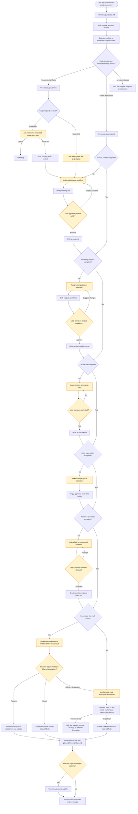

# Architect Setup Flow

```mermaid
flowchart TD
    Start([User requests Architect setup or recovery]) --> Load[Read setup-protocol.md]
    Load --> Audit[Audit existing architect/ artifacts]
    Audit --> Maturity[Detect greenfield or brownfield project context]
    Maturity --> Resume{Earliest missing or incomplete setup artifact?}
    Resume -->|No Architect artifacts| Overview[Present setup overview]
    Resume -->|Partial setup exists| ResumeNotice[Announce resume point]
    Resume -->|Already initialized| Halt[Halt and suggest propose or implement]
    Overview --> Inception{Greenfield or brownfield?}
    Inception -->|Brownfield| ScanPermission[Ask permission for a read-only project scan]
    ScanPermission -->|Denied| StopScan[Halt setup]
    ScanPermission -->|Approved| BrownfieldScan[Scan existing project context]
    Inception -->|Greenfield| GitGoal[Ask about git init and project goal]
    ResumeNotice --> ProductReady{Product context complete?}
    ProductReady -->|No| ProductMode[Ask product guide workflow]
    ProductReady -->|Yes| GuidelinesReady{Product guidelines complete?}
    BrownfieldScan --> ProductMode
    GitGoal --> ProductMode
    ProductMode --> ProductDraft[Draft product guide]
    ProductDraft --> ProductApproval{User approves product guide?}
    ProductApproval -->|Suggest changes| ProductMode
    ProductApproval -->|Approve| WriteProduct[Write product.md]
    WriteProduct --> GuidelinesReady
    GuidelinesReady -->|No| GuidelinesMode[Ask product guidelines workflow]
    GuidelinesReady -->|Yes| TechReady{Tech stack complete?}
    GuidelinesMode --> GuidelinesDraft[Draft product guidelines]
    GuidelinesDraft --> GuidelinesApproval{User approves product guidelines?}
    GuidelinesApproval -->|Suggest changes| GuidelinesMode
    GuidelinesApproval -->|Approve| WriteGuidelines[Write product-guidelines.md]
    WriteGuidelines --> TechReady
    TechReady -->|No| TechStackAsk[Ask or confirm technology stack]
    TechReady -->|Yes| StyleReady{Code style guides complete?}
    TechStackAsk --> TechStackApproval{User approves tech stack?}
    TechStackApproval -->|No| TechStackAsk
    TechStackApproval -->|Yes| WriteTechStack[Write tech-stack.md]
    WriteTechStack --> StyleReady
    StyleReady -->|No| StyleAsk[Ask code style guide selections]
    StyleReady -->|Yes| WorkflowReady{Workflow and index complete?}
    StyleAsk --> WriteStyle[Copy approved code style guides]
    WriteStyle --> WorkflowReady
    WorkflowReady -->|No| WorkflowAsk[Ask default or customized workflow]
    WorkflowReady -->|Yes| TrackRecovery{Incomplete first track exists?}
    WorkflowAsk --> WorkflowConfirm{User confirms workflow choices?}
    WorkflowConfirm -->|Change| WorkflowAsk
    WorkflowConfirm -->|Confirmed| Scaffolding[Create workflow.md and index.md]
    Scaffolding --> TrackRecovery
    TrackRecovery -->|Yes| InspectTrack[Inspect incomplete track and ask before changing it]
    TrackRecovery -->|No| TrackAsk[Ask for initial track description and details]
    InspectTrack --> TrackDecision{Resume, repair, or choose different description?}
    TrackDecision -->|Resume| ResumeTrack[Reuse existing track description and artifacts]
    TrackDecision -->|Repair| RepairTrack[Complete or repair missing track artifacts]
    TrackDecision -->|Different description| TrackAsk
    ResumeTrack --> SpecPlan
    RepairTrack --> SpecPlan
    TrackAsk --> Collision[Generate track ID and check tracks/ plus tracks.md collisions]
    Collision -->|Collision found| CollisionHalt[Halt and suggest resume, cleanup, or different description]
    Collision -->|No collision| CreateTrack[Create tracks.md and first track artifacts]
    CreateTrack --> SpecPlan[Generate spec.md and plan.md from workflow.md]
    SpecPlan --> CommitAsk{Did user explicitly request a commit?}
    CommitAsk -->|Yes| Commit[Commit Architect setup files]
    CommitAsk -->|No| Summary[Summarize created files and next steps]
    Commit --> Summary

    class ScanPermission,GitGoal,ProductMode,ProductApproval,GuidelinesMode,GuidelinesApproval,TechStackAsk,TechStackApproval,StyleAsk,WorkflowAsk,WorkflowConfirm,InspectTrack,TrackDecision,TrackAsk,CommitAsk human;
    classDef human fill:#fff3cd,stroke:#f0ad4e,stroke-width:2px,color:#111;
```
