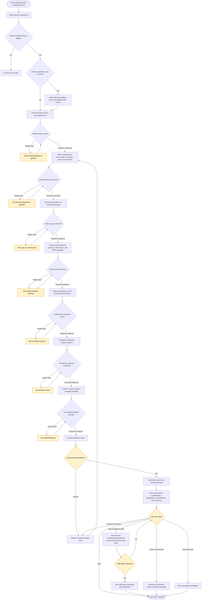

# Architect Discuss Flow

```mermaid
flowchart TD
    Start([User explicitly invokes architect-discuss]) --> Load[Read discuss-protocol.md]
    Load --> Trigger{Explicit architect-discuss trigger?}
    Trigger -->|No| Decline[Do not use this skill]
    Trigger -->|Yes| ContextNeed{Existing repository area involved?}
    ContextNeed -->|Yes| Scan[Read relevant architect docs and targeted code context]
    ContextNeed -->|No| Frame[Frame discussion from user requirement]
    Scan --> Frame
    Frame --> BackgroundGate{Problem frame clear?}
    BackgroundGate -->|Needs input| AskBackground[Ask focused background question]
    AskBackground --> BackgroundGate
    BackgroundGate -->|Passed or deferred| Requirements[Clarify requirements, users, goals, non-goals, and success criteria]
    Requirements --> RequirementGate{Requirement scope clear?}
    RequirementGate -->|Needs input| AskRequirement[Ask focused requirement question]
    AskRequirement --> RequirementGate
    RequirementGate -->|Passed or deferred| Scope[Decompose scope and choose draft target]
    Scope --> ScopeGate{Draft scope confirmed?}
    ScopeGate -->|Needs input| AskScope[Ask scope or split decision]
    AskScope --> ScopeGate
    ScopeGate -->|Passed or deferred| Product[Clarify product behavior, journeys, permissions, and MVP boundary]
    Product --> ProductGate{Product behavior clear?}
    ProductGate -->|Needs input| AskProduct[Ask product behavior question]
    AskProduct --> ProductGate
    ProductGate -->|Passed or deferred| Constraints[Clarify constraints and non-functional requirements]
    Constraints --> ConstraintGate{Architecture constraints clear?}
    ConstraintGate -->|Needs input| AskConstraint[Ask constraint question]
    AskConstraint --> ConstraintGate
    ConstraintGate -->|Passed or deferred| Options[Compare architecture direction options]
    Options --> OptionsGate{Architecture direction confirmed?}
    OptionsGate -->|Needs input| AskOption[Ask direction choice]
    AskOption --> OptionsGate
    OptionsGate -->|Passed or deferred| Tradeoffs[Confirm or defer direction-changing tradeoffs]
    Tradeoffs --> TradeoffGate{Key tradeoffs settled enough?}
    TradeoffGate -->|Needs input| AskTradeoff[Ask tradeoff decision]
    AskTradeoff --> TradeoffGate
    TradeoffGate -->|Passed or deferred| Readiness[Present readiness check]
    Readiness --> ReadyGate{Generate final synthesis?}
    ReadyGate -->|Revise| Reopen[Return to selected earlier loop]
    Reopen --> Requirements
    ReadyGate -->|Yes| Synthesis[Generate product and architecture draft]
    Synthesis --> SelfReview[Self-review draft for contradictions, placeholders, assumptions, and readiness]
    SelfReview --> NextStep{User next step?}
    NextStep -->|Continue discussion| Reopen
    NextStep -->|Save standalone draft| SavePath[Recommend architect/drafts/initiative-name.md and confirm safe path]
    SavePath --> SaveConfirm{Safe path confirmed?}
    SaveConfirm -->|No| NextStep
    SaveConfirm -->|Yes| SaveDraft[Save draft with reviewable edit mechanism]
    NextStep -->|Convert to proposal| Handoff[Summarize confirmed scope for architect-propose]
    NextStep -->|Split proposals| Split[Record proposal candidates]
    NextStep -->|Stop| End([Discussion complete])
    SaveDraft --> End
    Handoff --> End
    Split --> End

    class AskBackground,AskRequirement,AskScope,AskProduct,AskConstraint,AskOption,AskTradeoff,ReadyGate,NextStep,SaveConfirm human;
    classDef human fill:#fff3cd,stroke:#f0ad4e,stroke-width:2px,color:#111;
```
