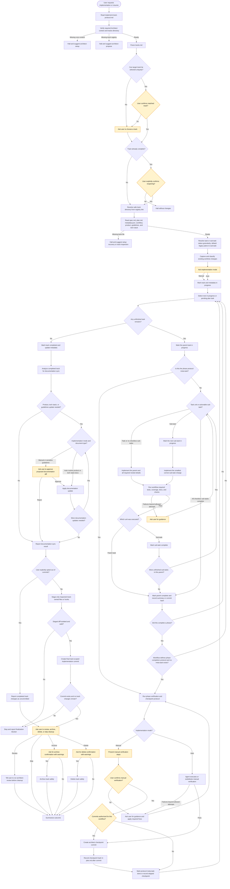

# Architect Implement Flow

```mermaid
flowchart TD
    Start([User requests implementation or resume]) --> Load[Read implement-track-protocol.md]
    Load --> SetupCheck[Verify required Architect context and tracks directory]
    SetupCheck -->|Missing core context| NotSetup[Halt and suggest architect-setup]
    SetupCheck -->|Missing track registry| NoTracks[Halt and suggest architect-propose]
    SetupCheck -->|Ready| Parse[Parse tracks.md]
    Parse --> Select{Can target track be selected uniquely?}
    Select -->|No| AskTrack[Ask user to choose a track]
    Select -->|Yes| ConfirmTrack{User confirms matched track?}
    ConfirmTrack -->|No| AskTrack
    ConfirmTrack -->|Yes| CompletedTrack{Track already complete?}
    AskTrack --> CompletedTrack
    CompletedTrack -->|No| Resolve[Resolve safe track directory from registry link]
    CompletedTrack -->|Yes| ReopenConfirm{User explicitly confirms reopening?}
    ReopenConfirm -->|No| StopReopen[Halt without changes]
    ReopenConfirm -->|Yes| Resolve
    Resolve --> TrackFiles[Read spec.md, plan.md, metadata.json, workflow, product, guidelines, and tech stack]
    TrackFiles -->|Missing track file| HaltIncomplete[Halt and suggest setup recovery or track inspection]
    TrackFiles -->|Ready| Granularity[Resolve task or sub-task status granularity; default legacy plans to sub-task]
    Granularity --> GitBaseline[Capture and classify existing worktree changes]
    GitBaseline --> ModeAsk[Ask implementation mode]
    ModeAsk -->|Manual| MarkTrack[Mark track and metadata in progress]
    ModeAsk -->|Auto| MarkTrack
    MarkTrack --> TaskLoop[Select next in-progress or pending plan task]
    TaskLoop --> NoWork{Any unfinished task remains?}
    NoWork -->|No| Finalize[Mark track completed and update metadata]
    NoWork -->|Yes| MarkParent[Mark the parent task in progress]
    MarkParent --> MetaTask{Is this the phase protocol meta-task?}
    MetaTask -->|Yes| PhaseProtocol[Run phase verification and checkpoint protocol]
    MetaTask -->|No| UnitKind{Task unit or actionable sub-task?}
    UnitKind -->|Task or no checkbox sub-tasks| Execute[Implement the parent and all required nested details]
    UnitKind -->|Sub-task| MarkSub[Mark the next sub-task in progress]
    UnitKind -->|All checkbox sub-tasks complete| CompleteParent
    MarkSub --> ExecuteSub[Implement the smallest correct sub-task change]
    ExecuteSub --> Verify[Run workflow-required tests, coverage, docs, and checks]
    Execute --> Verify[Run workflow-required tests, coverage, docs, and checks]
    Verify -->|Failures beyond allowed attempts| AskGuidance[Ask user for guidance]
    AskGuidance --> UnitKind
    Verify -->|Pass| CompleteUnit{Which unit was executed?}
    CompleteUnit -->|Parent task| CompleteParent[Mark parent complete and record summary or commit hash]
    CompleteUnit -->|Sub-task| CompleteSub[Mark sub-task complete]
    CompleteSub --> MoreSubs{More unfinished sub-tasks in this parent?}
    MoreSubs -->|Yes| UnitKind
    MoreSubs -->|No| CompleteParent
    CompleteParent --> PhaseDone{Did this complete a phase?}
    PhaseDone -->|No| TaskLoop
    PhaseDone -->|Yes| WorkflowPhaseProtocol{Workflow defines phase completion protocol and no meta-task exists?}
    WorkflowPhaseProtocol -->|No| TaskLoop
    WorkflowPhaseProtocol -->|Yes| PhaseProtocol
    PhaseProtocol --> ModeCheck{Implementation mode?}
    ModeCheck -->|Manual| ManualSteps[Present manual verification steps]
    ManualSteps --> ManualConfirm{User confirms manual verification?}
    ManualConfirm -->|No| PhaseGuidance[Ask user for guidance and apply required fixes]
    PhaseGuidance --> PhaseProtocol
    ManualConfirm -->|Yes| CheckpointAsk{Commits authorized for this workflow?}
    CheckpointAsk -->|Yes| CheckpointCommit[Create architect checkpoint commit]
    CheckpointAsk -->|No| MarkMetaDone[Mark protocol meta-task done or record skipped checkpoint]
    ModeCheck -->|Auto| AutoVerify[Agent executes or substitutes manual verification]
    AutoVerify -->|Failures beyond allowed attempts| PhaseGuidance
    AutoVerify -->|Pass| CheckpointCommit
    CheckpointCommit --> RecordCheckpointHash[Record checkpoint hash in plan.md after commit]
    RecordCheckpointHash --> MarkMetaDone
    MarkMetaDone --> TaskLoop
    Finalize --> DocsSync[Analyze completed track for documentation sync]
    DocsSync --> DocUpdateNeeded{Product, tech stack, or guidelines update needed?}
    DocUpdateNeeded -->|No| DocsReport[Report documentation sync result]
    DocUpdateNeeded -->|Yes| DocMode{Implementation mode and document type?}
    DocMode -->|Manual or sensitive guidelines| DocApproval[Ask user to approve proposed documentation diff]
    DocMode -->|Auto routine product or tech stack docs| UpdateDocs[Apply documentation update]
    DocApproval -->|Reject| DocsReport
    DocApproval -->|Approve| UpdateDocs
    UpdateDocs --> MoreDocs{More documentation updates needed?}
    MoreDocs -->|Yes| DocMode
    MoreDocs -->|No| DocsReport
    DocsReport --> FinalOptOut{User explicitly opted out of commits?}
    FinalOptOut -->|Yes| ReportUncommitted[Report completed track changes as uncommitted]
    FinalOptOut -->|No| StageFinal[Stage only inspected track-owned files or hunks]
    StageFinal --> SafeFinal{Staged diff isolated and valid?}
    SafeFinal -->|No| FinalBlocker[Stop and report finalization blocker]
    SafeFinal -->|Yes| CommitFinal[Create final track-scoped implementation commit]
    CommitFinal --> VerifyFinal{Commit exists and no track changes remain?}
    VerifyFinal -->|No| FinalBlocker
    VerifyFinal -->|Yes| CleanupChoice[Ask user to review, archive, delete, or skip cleanup]
    ReportUncommitted --> CleanupChoice
    CleanupChoice -->|Review| ReviewNotice[Tell user to run architect-review before cleanup]
    CleanupChoice -->|Skip| Summary[Summarize outcome]
    CleanupChoice -->|Archive| ArchiveConfirm[Ask for archive confirmation with warnings]
    CleanupChoice -->|Delete| DeleteConfirm[Ask for delete confirmation with warnings]
    ArchiveConfirm -->|Yes| Archive[Archive track safely]
    ArchiveConfirm -->|No| Summary
    DeleteConfirm -->|Yes| Delete[Delete track safely]
    DeleteConfirm -->|No| Summary
    ReviewNotice --> Summary
    Archive --> Summary
    Delete --> Summary

    class AskTrack,ConfirmTrack,ReopenConfirm,ModeAsk,AskGuidance,ManualSteps,ManualConfirm,CheckpointAsk,DocApproval,CleanupChoice,ArchiveConfirm,DeleteConfirm human;
    classDef human fill:#fff3cd,stroke:#f0ad4e,stroke-width:2px,color:#111;
```
