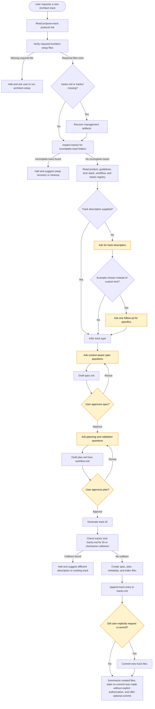

# Architect Propose Flow

```mermaid
flowchart TD
    Start([User requests a new Architect track]) --> Load[Read propose-track-protocol.md]
    Load --> SetupCheck[Verify required Architect setup files]
    SetupCheck -->|Missing required file| NotSetup[Halt and ask user to run architect-setup]
    SetupCheck -->|Required files exist| MgmtCheck{tracks.md or tracks/ missing?}
    MgmtCheck -->|Yes| RecoverMgmt[Recover management artifacts]
    MgmtCheck -->|No| IncompleteCheck[Inspect tracks/ for incomplete track folders]
    RecoverMgmt --> IncompleteCheck
    IncompleteCheck -->|Incomplete track found| HaltIncomplete[Halt and suggest setup recovery or cleanup]
    IncompleteCheck -->|No incomplete tracks| LoadContext[Read product, guidelines, tech stack, workflow, and tracks registry]
    LoadContext --> Description{Track description supplied?}
    Description -->|No| AskDescription[Ask for track description]
    Description -->|Yes| InferType[Infer track type]
    AskDescription --> Specifics{Example chosen instead of custom text?}
    Specifics -->|Yes| AskSpecifics[Ask one follow-up for specifics]
    Specifics -->|No| InferType
    AskSpecifics --> InferType
    InferType --> SpecQuestions[Ask context-aware spec questions]
    SpecQuestions --> DraftSpec[Draft spec.md]
    DraftSpec --> ConfirmSpec{User approves spec?}
    ConfirmSpec -->|Revise| SpecQuestions
    ConfirmSpec -->|Approve| PlanQuestions[Ask planning and validation questions]
    PlanQuestions --> DraftPlan[Draft plan.md from workflow.md]
    DraftPlan --> ConfirmPlan{User approves plan?}
    ConfirmPlan -->|Revise| PlanQuestions
    ConfirmPlan -->|Approve| TrackID[Generate track ID]
    TrackID --> Collision[Check tracks/ and tracks.md for ID or shortname collisions]
    Collision -->|Collision found| CollisionHalt[Halt and suggest different description or existing track]
    Collision -->|No collision| CreateFiles[Create spec, plan, metadata, and index files]
    CreateFiles --> Registry[Append track entry to tracks.md]
    Registry --> CommitAsk{Did user explicitly request a commit?}
    CommitAsk -->|Yes| Commit[Commit new track files]
    CommitAsk -->|No| Summary[Summarize created files, state no commit was made without explicit authorization, and offer optional commit]
    Commit --> Summary

    class AskDescription,AskSpecifics,SpecQuestions,ConfirmSpec,PlanQuestions,ConfirmPlan,CommitAsk human;
    classDef human fill:#fff3cd,stroke:#f0ad4e,stroke-width:2px,color:#111;
```
