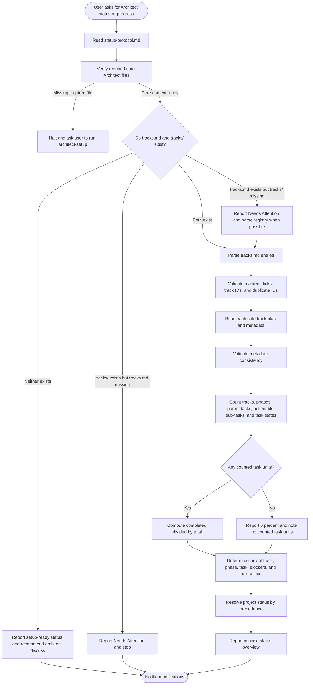

# Architect Status Flow

```mermaid
flowchart TD
    Start([User asks for Architect status or progress]) --> Load[Read status-protocol.md]
    Load --> SetupCheck[Verify required core Architect files]
    SetupCheck -->|Missing required file| NotSetup[Halt and ask user to run architect-setup]
    SetupCheck -->|Core context ready| TrackArtifacts{Do tracks.md and tracks/ exist?}
    TrackArtifacts -->|Neither exists| NoTracks[Report setup-ready status and recommend architect-discuss]
    TrackArtifacts -->|tracks/ exists but tracks.md missing| PartialNoRegistry[Report Needs Attention and stop]
    TrackArtifacts -->|tracks.md exists but tracks/ missing| PartialNoDirectory[Report Needs Attention and parse registry when possible]
    TrackArtifacts -->|Both exist| ParseRegistry[Parse tracks.md entries]
    NoTracks --> End
    PartialNoRegistry --> End
    PartialNoDirectory --> ParseRegistry
    ParseRegistry --> ValidateRegistry[Validate markers, links, track IDs, and duplicate IDs]
    ValidateRegistry --> ReadTracks[Read each safe track plan and metadata]
    ReadTracks --> ValidateMetadata[Validate metadata consistency]
    ValidateMetadata --> Count[Count tracks, phases, parent tasks, actionable sub-tasks, and task states]
    Count --> Percent{Any counted task units?}
    Percent -->|Yes| ComputePercent[Compute completed divided by total]
    Percent -->|No| ZeroPercent[Report 0 percent and note no counted task units]
    ComputePercent --> Current[Determine current track, phase, task, blockers, and next action]
    ZeroPercent --> Current
    Current --> ProjectStatus[Resolve project status by precedence]
    ProjectStatus --> Report[Report concise status overview]
    Report --> End([No file modifications])

    %% This read-only status skill has no human-in-the-loop decision prompt.
    classDef human fill:#fff3cd,stroke:#f0ad4e,stroke-width:2px,color:#111;
```
